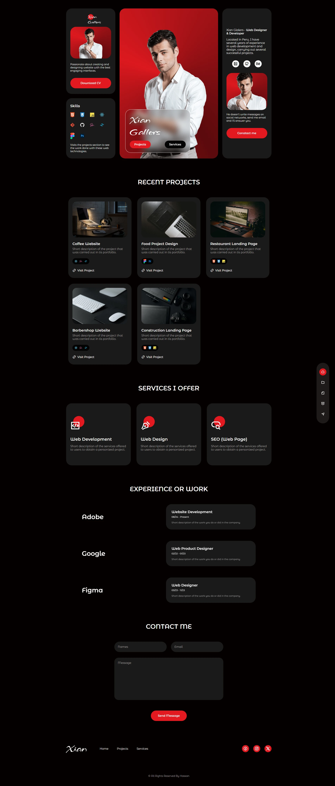

# 💼 Personal Portfolio Website

A modern and responsive personal portfolio website built using **HTML, CSS, and JavaScript**. This project showcases my skills, projects, services, and experience in a clean and visually appealing design.

---

## 🚀 Live Demo

👉 https://xiangallers.vercel.app/

---

## 📸 Preview


---

## ✨ Features

* Responsive design (Mobile + Desktop)
* Modern UI/UX layout
* Projects showcase section
* Services section
* Experience timeline
* Contact form UI
* Smooth animations

---

## 🛠️ Technologies Used

* HTML5
* CSS3
* JavaScript (Vanilla JS)

---

## 📂 Project Structure

```
├── index.html
├── style.css
├── script.js
├── assets/
│   ├── images/
│   └── icons/
```

---

## ⚙️ How to Run Locally

1. Clone the repository:

```
git clone https://github.com/your-username/your-repo-name.git
```

2. Open the folder:

```
cd your-repo-name
```

3. Run the project:

* Open `index.html` in your browser

---

## 📬 Contact

Feel free to reach out:

* Email: hcodex5@gmail.com
* GitHub: https://github.com/devhassanakhtar

---

## ⭐ Support

If you like this project, give it a ⭐ on GitHub!

---
